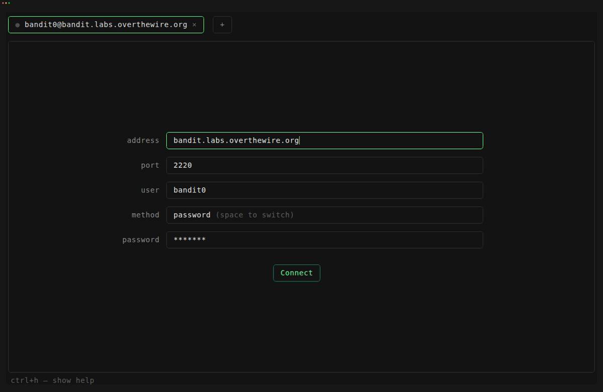

# lazyssh

A small, full-screen SSH client with browser-style tabs. Fill in a server, hit Connect, and you're in — no config file, no flags to remember. Open more tabs for more sessions; background tabs keep running while you work in another.

<p align="center">
  
</p>

Built on [`bubble-ssh`](https://github.com/muhamm-ad/bubble-ssh), which does the actual SSH-session-as-a-Bubble-Tea-component work; `lazyssh` is the form, tabs, and chrome wrapped around it.

## Install

```bash
go install github.com/muhamm-ad/lazyssh@latest
```

or clone and run directly:

```bash
git clone https://github.com/muhamm-ad/lazyssh.git
cd lazyssh
go run .
```

## Usage

```bash
lazyssh
lazyssh -version   # or -v
```

### Host Keys

Host keys are trusted on first connection and remembered in your normal `~/.ssh/known_hosts` from then on (same as `ssh -o StrictHostKeyChecking=accept-new`) — see [bubble-ssh's docs](https://github.com/muhamm-ad/bubble-ssh) if you want to know exactly what that trade-off means.

## What this is (and isn't) today

v0 is intentionally small: multi-tab sessions, nothing saved between runs, password or key file only. That's not the ceiling — see [TODO.md](./TODO.md) for what's planned.

## License

MIT, see [LICENSE](./LICENSE).
